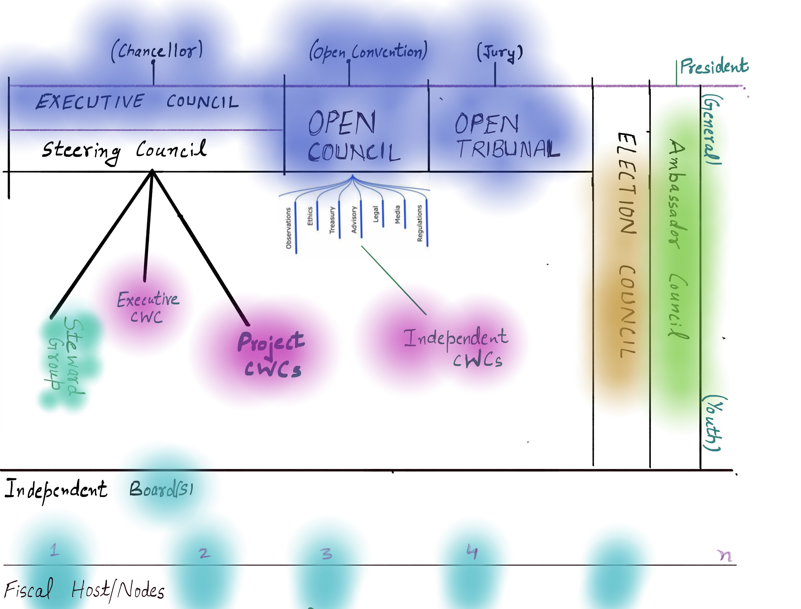

# 🎵 Open Constitution

This space houses public facing records of our **guidelines, and directives and wherever applicable Terms & conditions.**

Note: The above illustration is for representational purposes only.&#x20;



a. We record your activity when you visit this section with the help of browser cookies in accordance to different data privacy & consent laws.

b. Muellners Foundation is a global co-operative. The Foundation operates its initiatives across different regions of the world, primarily over the Internet.

These public facing policy "instruments" and guidelines are based on **Muellners Foundation’s** active compliance to various Local jurisdictions and Information Technology Acts, Cyber Security Laws, Legal Contract Binding Acts, Business Laws.&#x20;

\
These public facing records also guideline Foundation's active compliance with General Public in form of governments of regions/countries, where we run our initiatives, with our democratic principles.

<mark style="color:purple;">Please feel free to reach out in case of queries.</mark>&#x20;

<mark style="color:purple;">Email - Legal Affairs; Muellners Foundation - legal@muellners.org</mark>



<mark style="color:purple;">**IMPRINT: Please visit the specific page of a Fiscal Host, listing the Legal Impressum and public details on the Legal Body:**</mark>

<mark style="color:purple;">****</mark>:flag\_eu:<mark style="color:purple;">****</mark>[<mark style="color:purple;">**EEA(European Economic Area)**</mark> ](fiscal-hosts/european-economic-area.md)

*   <mark style="color:purple;">©2019-2022:Muellners® (Frivilig Forening)Foundation,</mark>&#x20;

    <mark style="color:purple;">Nygade 3, 4.2, Copenhagen 1164, Denmark</mark>&#x20;

<mark style="color:purple;">CVR nummer- 41008407, P nummer- 1025331717;</mark>

_<mark style="color:purple;">Download Public Documents of Foundation's first Fiscal Host</mark>_[ _<mark style="color:purple;">here.</mark>_](fiscal-hosts/european-economic-area.md)_<mark style="color:purple;"></mark>_

<mark style="color:purple;">****</mark>

_<mark style="color:purple;">****</mark>_:flag\_in:_<mark style="color:purple;">****</mark>_[_<mark style="color:purple;">**Republic of India:**</mark>_](fiscal-hosts/republic-of-india.md)_<mark style="color:purple;">****</mark>_

* <mark style="color:purple;">©2021-2022:</mark>[<mark style="color:purple;">Cynsar Foundation</mark>](fiscal-hosts/republic-of-india.md) <mark style="color:purple;">****</mark>&#x20;

_<mark style="color:purple;">Download Public Documents of Foundation's</mark>_ <mark style="color:purple;"></mark><mark style="color:purple;">second</mark> <mark style="color:purple;"></mark>_<mark style="color:purple;">Fiscal Host</mark>_ [_<mark style="color:purple;">here</mark>_](fiscal-hosts/republic-of-india.md)_<mark style="color:purple;">.</mark>_



<mark style="color:purple;">****</mark>

* <mark style="color:purple;">Muellners® is a registered trademark of</mark> <mark style="color:purple;"></mark>_<mark style="color:purple;">Foundation Data Processor:</mark>_ <mark style="color:purple;"></mark><mark style="color:purple;">Muellners ApS, CVR nummer-41548304, P nummer -1026073886, and as per Vienna Codification.</mark>

_<mark style="color:purple;"></mark>_



<mark style="color:red;">**Public Notice:**</mark> <mark style="color:red;"></mark><mark style="color:red;">These are the public facing records for Serenity Governance System.</mark>&#x20;

<mark style="color:red;">**This content along with internal systems, and our technical workflows make the whole Open Constitution based governance protocols.**</mark> \ <mark style="color:red;">**Open Constitution goes through amendments all the time.**</mark>&#x20;

<mark style="color:red;">Open Constitution defines several covenants and articles of association for the Foundation's citizens.</mark>

<mark style="color:red;"></mark>\ <mark style="color:red;"></mark><mark style="color:green;">a. You can use the information in these sections to publish at news websites, blogs and any other medium over the Internet. Don't forget to cite this section by simply embedding this url.</mark>

<mark style="color:green;">b. You can use the information in these sections to govern your own organisation, with this constitution on your own. For more details, read about Serenity.</mark>\ <mark style="color:green;"></mark>\ <mark style="color:green;"></mark><mark style="color:red;">Wherever possible, please cite the Open Constitution's instrument(document page), when you reuse the constitution in your organisation.</mark> \ <mark style="color:red;"></mark>

[**Executive Council**](foundation/executive-council.md)****

