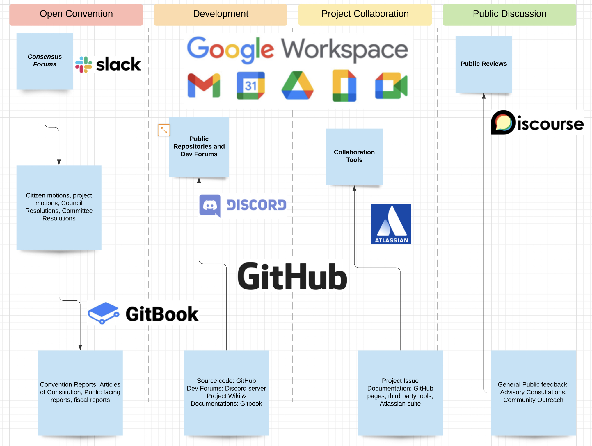
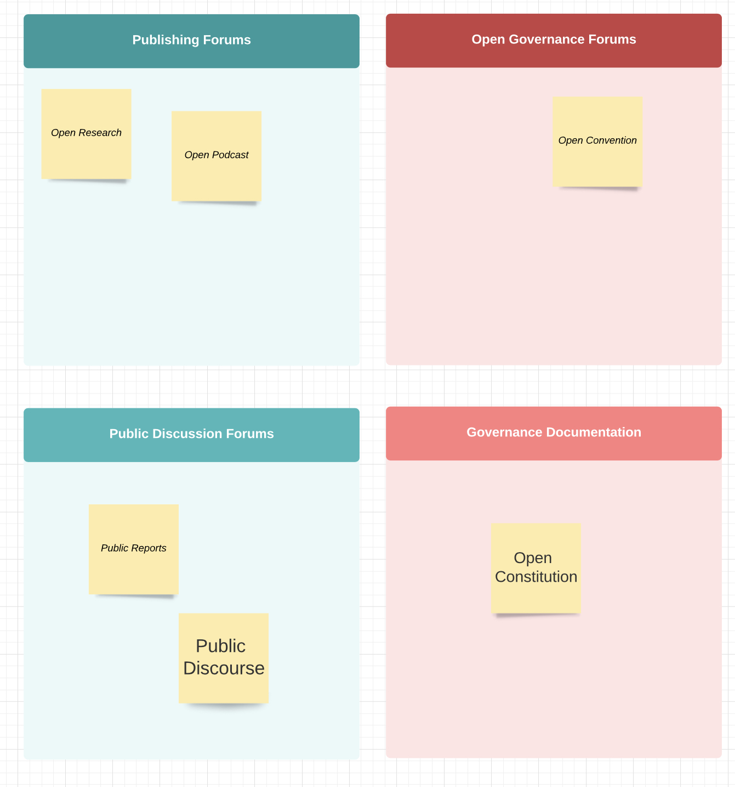

# 📻 Open Communications Charter


<mark style="color:purple;">Open Constitution is a multi-polar community with diverse groups of members, participating in the global co-operative.</mark>

<mark style="color:purple;">Members also collaborate on multiple communications tools, and project collaboration tools, some are standards for best practices in creating open source intelligence, and intellectual property.</mark>

<mark style="color:purple;">Members use different communications and publishing platforms for their research and development.</mark>


.jpg>)


_Scope of Amendments:_\
_a. Any Internet or Satellite based communications systems can be added in this Communications Charter._



Scope of Amendments:

Any third party tool can be added into the Communications Charter.



Read [Code of Conduct](code-of-conduct.md) and [Open Access](open-access-charter.md) Charter.

****[**Read Community Guidelines on Communications and publishing tools.**](https://docs.muellnersfoundation.info)****

**Read** [**Open Research guidelines**](https://docs.muellnersfoundation.info/open-research/guidelines)**.**


