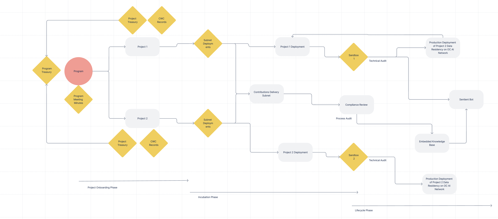

# 🖥️ IP Lifecycle Charter

The following controls and checks are placed on the Open Constitution AI network for any Project Deployment.

<figure><figcaption>
Illustration 1: Programs and project deployments
</figcaption></figure>


TRL Level Transition of Project Deployments


Relevant Read: [I.P. Lifecycle Policy](../open-source-policies/ip-lifecycle-policy.md)
