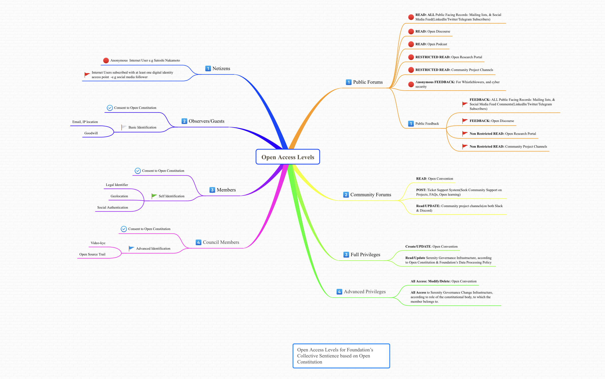

# 🚪 Open Access Charter



1. To subscribe to the Open Research or any Open Constitution artefacts on the Internet, you may simply subscribe to the Subscription Forms available on any of the sites of the Open Constitution network.
2. **GUEST ACCOUNT:** If you are looking to contribute but not sure how to start, you can become a Guest of the Open Constitution by activating a Guest Account.

&#x20;      **Register a** [**Guest Account**](https://open-bank.org)**.**&#x20;

3. **CITIZENSHIP:** If you have made up your mind to join the Open Constitution as an e-resident, you shall activate [E Residency](https://www.muellners.org/e-residency/)**.** \

4. **ORGANIZATIONS:** If your Organisation wants to be part of the Open Constitution network, please register Tenancy, and activate access for your Organisation's beneficiaries. \

**Open a borderless Trust Account at** [**Open Bank Portal**](https://www.open-bank.org/my-account/) **on the network.**

Read [**Knowledge Base**](https://openconstitution.atlassian.net/wiki/spaces/ER1/overview)


**Custodian:** [**Executive Council**](../foundation/executive-council.md)
