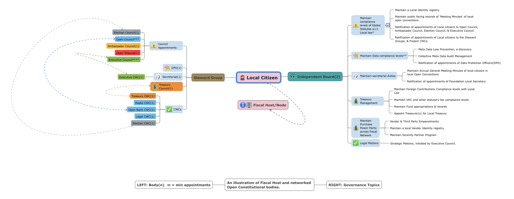

# 📚 Fiscal Hosts

> **What is a fiscal host?**&#x20;
>
> Fiscal hosting is **where a legally registered organisation** (the fiscal host, also known as Foundation's regional official representation) holds money, trust and fiduciary duties on behalf of Foundation's global community and open source intelligence network.


<mark style="color:green;">The principal Legal Steward: Muellners Foundation nominates and appoints</mark> <mark style="color:green;"></mark><mark style="color:green;">**Fiscal Hosts**</mark> <mark style="color:green;"></mark><mark style="color:green;">in each member state of the UN as fiduciary bodies.</mark>

<mark style="color:green;">Local Independent Boards are constituted from these</mark> <mark style="color:green;"></mark><mark style="color:green;">**Fiduciary bodies.**</mark>

<mark style="color:green;">Fiscal Hosts also maintain local membership and beneficiary citizen registry.</mark> \ <mark style="color:green;">Fiscal Hosts maintain the Foundation's compliance with local business laws, besides holding trust and funds on behalf of the Muellners Foundation.</mark>

Global Statutes prescribe Articles and instruments to Fiscal Hosts to fully address compliance of constituent legal bodies of this Public Association's activities in the local jurisdictions e.g. in the context of the Information Technology Acts, Cyber Security Laws, Legal Contract Binding Acts, Business Laws etc.

\
<mark style="color:blue;">Fiscal Host Legal Bodies and their members continue to independently work on the local advocacy of the Foundation's guiding principles.</mark>&#x20;

<mark style="color:green;">Each Fiscal Host appoints an Independent Board, which also represents the local community of the Foundation.</mark>&#x20;

<mark style="color:green;">The local Independent Board members also appoint a third-party Data Protection Officer, an auditor and a chartered accountant in accordance with the Open Constitution, and based on local requirements of compliance with business laws.</mark>



<mark style="color:red;">💁Muellners Foundation screens Fiscal hosts, with independent and autonomous diligence, before a nomination and subsequent appointment is filed on the Open Constitution Governance System.</mark> &#x20;

<mark style="color:blue;">Muellners Foundation also periodically reviews the Fiscal Hosts' local compliance with the help of periodical audits(annual audits).</mark>&#x20;

<mark style="color:blue;">The Treasury and Regulatory Compliance audits are released to the general public, in the form of a quarterly "Transparency Report", regardless of whether local business laws require an audit or not.</mark>&#x20;

<mark style="color:red;">**The following members participate in the screening and dilligence:**</mark>

<mark style="color:blue;">Fiscal Host's Steward Group, Legal CWC and Open Council bodies namely Regulations, Legal and Treasury Council.</mark>



**Relevant:** [Fiscal Hosts](broken-reference) or Fiscal Nodes on the Open Constitution Network.&#x20;

Each Fiscal Node deploys and maintains a nodal ledger. See the Open Constitution [Network Diagram](../oc-network/network-diagram.md). &#x20;

Also, See the Open Constitution [Network Fiscal Diagram](legal-impressum/network-fiscal-diagram.md).&#x20;


