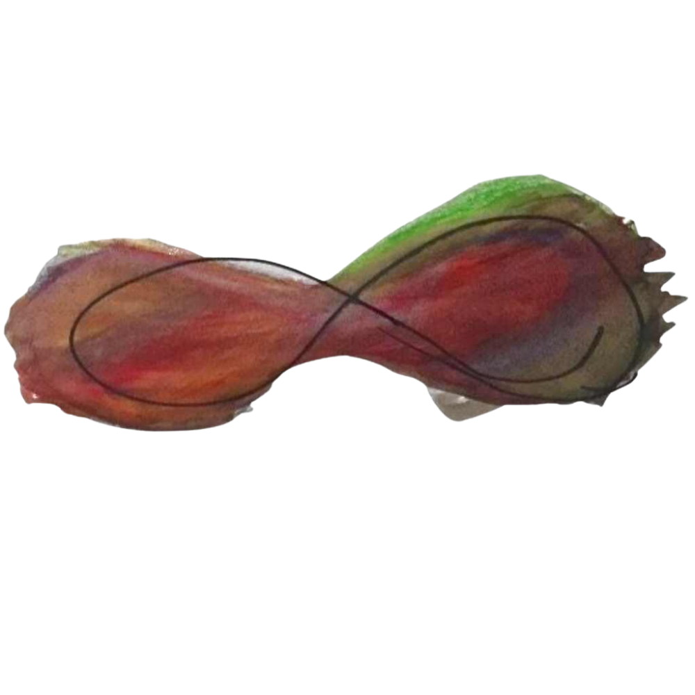

# ™️ Brand Usage Policy

## Logos:

&#x20;Please use the following logo for any Foundation digital public services.

<figure><figcaption>
Foundation logo 1
</figcaption></figure>

<figure><figcaption>
Foundation Logo 2
</figcaption></figure>

Please download the following logo for the Finscale project.

#### Impressum:

Muellners® & Finscale® are registered trademarks of Muellners ApS, Data Processor of Muellners Foundation, CVR nummer-41548304, P nummer -1026073886, and as per Vienna Codification. For brand copyright violations, please report to legal@muellners.org.

